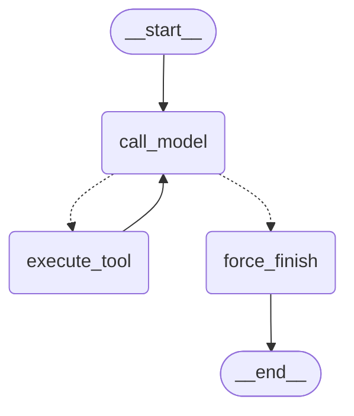
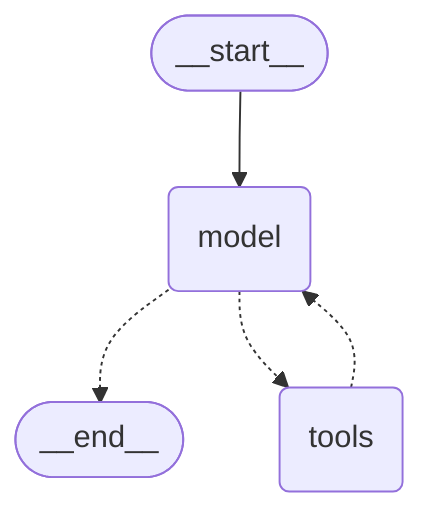

# Отчёт: LangGraph vs императивный цикл — Блок 6.3

Тот же ReAct-агент из ДЗ 6.2, переписанный на LangGraph 1.x двумя путями —
руками (`custom_graph`) и через `langchain.agents.create_agent`
(`prebuilt_graph`) — сравнивается с loop-baseline (`agent_naive.py`, ДЗ 6.1)
на тех же 5 задачах, что и в ДЗ 6.2. Self-reflection из `agent_react.py` в
граф намеренно не перенесена — цель этого ДЗ сравнить формы оркестрации, а
не переиспытывать reflection на новом движке.

## 1. Конфигурация

| Параметр | Значение |
|---|---|
| Модель | `gpt-5.4-mini` |
| Температура | `0` (детерминированная генерация у графов; у `agent_naive.py` температура не задавалась явно — дефолт SDK) |
| `max_iterations` (`MAX_ITERATIONS`) | `6` |
| Tools | `search_knowledge_base`, `get_current_time`, `send_telegram_message` — те же 3, что в ДЗ 6.2, перенесены через `@tool` |

## 2. State contract

```python
class AgentState(TypedDict):
    messages: Annotated[list[AnyMessage], add_messages]
    iteration_count: int
    tool_results: Annotated[list[dict], operator.add]
```

- `messages` — reducer `add_messages`: новые сообщения **добавляются** к
  истории, а не перезаписывают её. Без этого reducer'а каждый `return
  {"messages": [...]}` из узла заменял бы весь список одним новым
  сообщением — история потерялась бы после первого же шага.
- `iteration_count` — без `Annotated`, reducer по умолчанию `replace`:
  каждый узел явно возвращает новое значение (`state["iteration_count"] +
  1`), накопление не нужно, достаточно последнего числа.
- `tool_results` — reducer `operator.add`: списки из разных вызовов
  `execute_tool` конкатенируются, так по итогу прогона видно все реально
  выполненные tool-вызовы для отчёта/трейсинга, не только последний.
- В state нет SDK-клиентов, http-сессий, API-ключей — только
  сериализуемые данные (`str`, `int`, `list[dict]`, объекты сообщений
  `langchain_core.messages`, которые сами сериализуемы). Это осознанное
  требование на будущее: как только подключается checkpointer
  (`AsyncSqliteSaver`/`AsyncPostgresSaver`), он сериализует **весь** state
  на диск/в БД между шагами — несериализуемый объект в state сломал бы
  чекпойнтинг незаметно, до первого падения при восстановлении сессии.

## 3. Router-логика и stop conditions

```python
def route_after_model(state: AgentState) -> Literal["execute_tool", "force_finish"]:
    if state["iteration_count"] >= MAX_ITERATIONS:
        return "force_finish"
    last = state["messages"][-1]
    return "execute_tool" if getattr(last, "tool_calls", None) else "force_finish"
```

Router — чистая функция: только читает `state`, ничего не пишет, не делает
сетевых вызовов, типизирована через `Literal[...]`. Два условия
остановки: (1) лимит итераций исчерпан — уводит в `force_finish`
независимо от того, просит ли модель ещё tool; (2) у последнего сообщения
нет `tool_calls` — обычное завершение, тоже в `force_finish`, который в
этом случае просто прокидывает готовый ответ.

**Проверка стоп-крана.** Реальный прогон против намеренно "сломанного"
`search_knowledge_base` (`scripts/verify_force_finish.py`, часть 1)
показал, что модель сама распознаёт бесполезный результат и сдаётся раньше
лимита (за 3-4 шага из 6) — стоп-кран в этом прогоне не потребовался. Это
хорошее свойство модели, но ненадёжный способ детерминированно проверить
сам механизм. Поэтому там же, часть 2 — прямой юнит-тест
`route_after_model`/`force_finish` с синтетическим state
(`iteration_count = MAX_ITERATIONS`, у последнего сообщения есть
`tool_calls`) — подтвердил: router возвращает `"force_finish"`, а сам узел
отдаёт явное `"Превышен лимит итераций (6). Не удалось сформировать
финальный ответ за отведённое число шагов."`, не зависает и не падает.

## 4. Mermaid-схема кастомного графа



Для сравнения — внутренняя схема `prebuilt_graph` (`create_agent`), из
`docs/agent-graph-prebuilt.mmd`:



Видно уже здесь: у prebuilt нет отдельного узла `force_finish` — три узла
`custom_graph` сжаты в два (`model`, `tools`), а обработка лимита итераций
и формирование явного сообщения об исчерпании лимита скрыты внутри
реализации `create_agent`, недоступны для кастомизации напрямую.

## 5. Бенчмарк: naive vs custom vs prebuilt

5 задач × 3 реализации × 3 повтора, усреднено (`scripts/bench_agents.py`,
сырые данные — `docs/agent-graph-bench-raw.json`):

| # | Задача | Реализация | latency_ms | prompt_tokens | completion_tokens | total_tokens | steps |
|---|--------|-----------|-----------|----------------|---------------------|--------------|-------|
| 1 | Гарантия на смартфоны (простая) | naive | 1900.1 | 1088.7 | 84.0 | 1172.7 | 2.0 |
| | | custom | 3057.3 | 1075.7 | 122.3 | 1198.0 | 2.0 |
| | | prebuilt | 2900.7 | 1310.0 | 135.7 | 1445.7 | 2.0 |
| 2 | Время в Москве (простая) | naive | 1686.2 | 1063.0 | 36.7 | 1099.7 | 2.0 |
| | | custom | 1441.9 | 919.0 | 33.7 | 952.7 | 2.0 |
| | | prebuilt | 1324.0 | 1151.0 | 30.7 | 1181.7 | 2.0 |
| 3 | Гарантия → Telegram (составная) | naive | 2162.1 | 1098.0 | 113.7 | 1211.7 | **2.0** |
| | | custom | 3492.5 | 1814.7 | 189.7 | 2004.3 | 3.0 |
| | | prebuilt | 3782.3 | 2163.0 | 187.0 | 2350.0 | 3.0 |
| 4 | Время → Telegram (составная) | naive | 2436.7 | 1754.7 | 97.0 | 1851.7 | 3.0 |
| | | custom | 2733.2 | 1533.0 | 99.3 | 1632.3 | 3.0 |
| | | prebuilt | 2931.2 | 1884.7 | 103.7 | 1988.3 | 3.0 |
| 5 | Скидка 15% (провокационная) | naive | 933.7 | 519.0 | 39.3 | 558.3 | 1.0 |
| | | custom | 1152.9 | 447.0 | 52.0 | 499.0 | 1.0 |
| | | prebuilt | 885.8 | 564.0 | 27.7 | 591.7 | 1.0 |
| | **Итого (сумма по 5 задачам)** | naive | **9118.8** | — | — | **5894.1** | **10** |
| | | custom | **11877.8** | — | — | **6286.3** | **11** |
| | | prebuilt | **11824.0** | — | — | **7557.4** | **11** |

## 6. Custom vs prebuilt

**Что пришлось писать руками в `custom_graph`:** весь `AgentState` с
reducer'ами, три узла (`call_model`, `execute_tool`, `force_finish`),
router и его условия остановки, явная сборка рёбер. Это ~120 строк, но
каждая строчка — решение, которое видно и можно поменять: логика "что
считать лимитом", "что делать при неизвестном tool", формат сообщения при
исчерпании лимита — всё написано и задокументировано нами.

**Что `create_agent` сделал самостоятельно:** весь граф целиком — узлы
`model`/`tools`, router между ними, свою версию stop-condition при
достижении внутреннего лимита шагов. Ушло 4 строки вызова. Но — таблица
выше показывает, что `prebuilt` стабильно тратит **больше prompt_tokens**,
чем `custom`, почти на каждой задаче (1310 vs 1076 на задаче 1, 2163 vs
1815 на задаче 3, 1885 vs 1533 на задаче 4) — вероятно, `create_agent`
добавляет собственный системный/tool-форматирующий оверхед, которым
нельзя управлять напрямую, как в `custom_graph`.

**Когда какой путь предпочтительнее.** Задача 3 — самая показательная:
`naive` внезапно уложился в 2 шага вместо 3, потому что модель сама
объединила `search_knowledge_base` и `send_telegram_message` в один
parallel tool_call — system prompt `agent_naive.py` этого не запрещает. А
у `custom_graph`/`prebuilt_graph` system prompt (в `agent_graph.py`)
специально требует "вызывай не более одного инструмента за шаг" — именно
поэтому оба графа стабильно взяли 3 шага. Это значит: разница в latency
между naive (2162 мс) и графами (3492-3782 мс) на этой задаче — **не
преимущество императивного цикла**, а разный system prompt и везение с
параллелизацией модели, а не фундаментальное свойство архитектуры. Вывод:
для быстрого прототипа с 2-3 tools, где не нужен чекпойнтинг/HITL/supervisor
— писать руками экономит и токены, и сложность (`custom` дешевле
`prebuilt` по токенам почти везде). Как только появляется потребность в
персистентности, ветвлении на несколько агентов или человеческом
подтверждении — граф (в любом варианте) окупается, а голый цикл придётся
переписывать с нуля.

## 7. Реальный баг отладки

При первом запуске `scripts/visualize_graph.py` командой `python
scripts/visualize_graph.py` (не `python -m ...`) — `ModuleNotFoundError:
No module named 'app'`. Причина: при прямом запуске файла Python кладёт в
`sys.path` только директорию самого скрипта (`scripts/`), а не корень
проекта, поэтому `from app.services.agent_graph import ...` не находит
пакет `app`. В проекте уже есть устоявшееся решение этой же проблемы в
`scripts/run_eval.py` (вставка `ROOT = Path(__file__).resolve().parent.parent`
в `sys.path` перед импортом) — то же самое добавлено в
`visualize_graph.py`, `bench_agents.py` и `verify_force_finish.py` для
консистентности со всеми остальными скриптами проекта.

Второй, менее очевидный момент (пойман до реального прогона, при
написании кода, но стоит отдельного упоминания): `prebuilt_graph`,
собранный через `create_agent`, использует **свою** схему state, не нашу
`AgentState` — вызов `prebuilt_graph.ainvoke({"messages": [...],
"iteration_count": 0, "tool_results": []})` с теми же полями, что у
`custom_graph`, скорее всего упал бы или проигнорировал лишние поля,
поэтому CLI (`agent_graph.py __main__`) и `bench_agents.py` передают
`prebuilt_graph` только `{"messages": [...]}`, без `iteration_count`/
`tool_results` — эти два runnable несовместимы по входному контракту,
несмотря на то что решают одну и ту же задачу.

## 8. Что блокирует переход к персистентности

Сейчас `custom_graph = builder.compile()` собран без `checkpointer` —
состояние графа существует только в памяти процесса на время одного
`ainvoke()` и нигде не сохраняется между вызовами. Для чекпойнтинга нужно:

1. `builder.compile(checkpointer=AsyncSqliteSaver.from_conn_string(...))`
   (или `AsyncPostgresSaver` для прода) — граф начнёт сохранять снимок
   state после каждого узла;
2. каждый вызов `ainvoke(...)` должен передавать `config={"configurable":
   {"thread_id": "..."}}`, чтобы checkpointer знал, к какой именно
   "беседе" относится состояние (без этого он либо упадёт, либо будет
   считать каждый вызов новым threads).

Ни то, ни другое в этом ДЗ не подключено — `AgentState` уже готов к этому
(только сериализуемые данные, см. раздел 2), но `thread_id` в
`bench_agents.py` намеренно не добавлен: без реального checkpointer'а это
чистый no-op, а бенчмарк и так уже прогнан на 45 запусках — добавление
`thread_id` не изменило бы ни одной цифры в таблице выше, только
подготовило бы интерфейс вызова на будущее. Следующий логичный шаг —
подключить `AsyncSqliteSaver` в отдельном ДЗ и заново прогнать те же 5
задач, уже с реальным сохранением истории между запросами.
