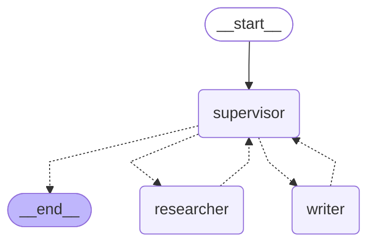

# Схема supervisor-графа — Блок 6.5

Сгенерировано `app.get_graph().draw_mermaid()` в `experiments/multi_agent_langgraph.py`.

```mermaid
---
config:
  flowchart:
    curve: linear
---
graph TD;
	__start__([<p>__start__</p>]):::first
	supervisor(supervisor)
	researcher(researcher)
	writer(writer)
	__end__([<p>__end__</p>]):::last
	__start__ --> supervisor;
	researcher -.-> supervisor;
	supervisor -.-> __end__;
	supervisor -.-> researcher;
	supervisor -.-> writer;
	writer -.-> supervisor;
	classDef default fill:#f2f0ff,line-height:1.2
	classDef first fill-opacity:0
	classDef last fill:#bfb6fc

```
