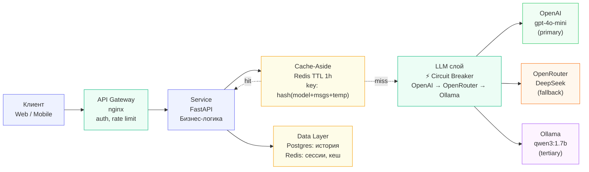

# Архитектурный паспорт: ИИ-консультант ТехноМаркет

## Диаграмма компонентов



## ADR-001: Выбор паттерна взаимодействия

**Status:** Accepted (2026-06-28)

**Context.**
Проект — ИИ-консультант интернет-магазина ТехноМаркет. Ожидаемая нагрузка —
600 запросов в день (≈ 20 RPM в пике), средний ответ — 200–300 токенов (2–5 секунд
генерации). Бюджет — $3.5/месяц на API. Пользователи взаимодействуют через
веб-интерфейс или CLI.

**Decision.**
Выбран **Request-Response** паттерн. Консультант получает вопрос покупателя,
обращается к LLM (с кешированием повторных вопросов) и возвращает готовый ответ.
При нагрузке 20 RPM и коротких ответах стриминг не даёт существенного преимущества.

**Consequences.**
- Плюсы: простота реализации, легко кешировать, предсказуемая стоимость.
- Минусы: пользователь ждёт 2–5 секунд без визуальной обратной связи.

**Alternatives considered.**
- Streaming (SSE) — отвергнут на MVP-этапе: усложняет nginx и FastAPI,
  при коротких ответах выигрыш по UX минимален.
- Queue-based — отвергнут: избыточно для интерактивного чата с низкой нагрузкой.

---

## ADR-002: Стратегия fault tolerance

**Status:** Accepted (2026-06-28)

**Decision.**
- **Primary:** OpenAI gpt-4o-mini — лучший баланс цена/качество для русского языка.
- **Fallback:** OpenRouter (DeepSeek) — дешевле, подходит для простых вопросов.
- **Tertiary:** Ollama qwen3:1.7b — локально, на случай полного отказа облаков.

**Circuit Breaker:** по одному на каждого провайдера. При 3 ошибках подряд —
провайдер пропускается на 60 секунд.

**Cache-Aside:** Redis (или in-memory), TTL 1 час,
ключ: `sha256(model + messages + temperature)`.

**Consequences.**
- Плюсы: сервис работает даже при падении OpenAI. Кеш снижает расходы на 40–60%.
- Минусы: Ollama медленный на CPU (10–30 сек), нужен отдельный сервер для Redis.

---

## Нагрузочные характеристики

| Параметр | Значение |
|----------|----------|
| Запросов в день | 600 |
| RPM в пике | ~20 |
| Средний размер ответа | 200–300 токенов |
| Бюджет API | $3.5/месяц |
| Целевой cache hit rate | 40–60% |
| TTL кеша | 1 час |

---

## Потенциальные точки отказа

| Слой | Что произойдёт | Стратегия деградации |
|------|---------------|----------------------|
| **API Gateway** | Запросы не доходят до сервиса | Rate limit защищает от перегрузки; nginx перезапускается автоматически |
| **Service (FastAPI)** | Бизнес-логика недоступна | Возврат 503 с понятным сообщением; автоперезапуск через systemd |
| **LLM слой** | OpenAI недоступен | Circuit Breaker → переключение на OpenRouter → Ollama → template-ответ из FAQ |
| **Cache (Redis)** | Кеш недоступен | Все запросы идут напрямую в LLM — сервис работает, но дороже |
| **Data (Postgres)** | История не сохраняется | Диалог продолжается без персистентной истории; логи пишутся в файл |

---

## LiteLLM

### Решение
После изучения LiteLLM принято решение **реализовать fallback самостоятельно** через
`robust_client.py` (уже реализован в ДЗ 2.3), а не использовать LiteLLM proxy.

**Обоснование:**
- Текущая нагрузка (600 req/day) не требует отдельного gateway-сервиса
- `robust_client.py` уже покрывает retry + fallback + логирование
- LiteLLM добавляет зависимость от Docker и отдельного процесса
- При росте нагрузки свыше 10 000 req/day — целесообразно перейти на LiteLLM

### Config (для будущего использования)
```yaml
# docs/litellm/config.yaml
model_list:
  - model_name: primary
    litellm_params:
      model: openai/gpt-4o-mini
      api_key: os.environ/OPENAI_API_KEY

  - model_name: fallback
    litellm_params:
      model: openai/deepseek-chat
      api_base: https://openrouter.ai/api/v1
      api_key: os.environ/OPENROUTER_API_KEY

router_settings:
  num_retries: 3
  fallbacks: [{"primary": ["fallback"]}]
```
