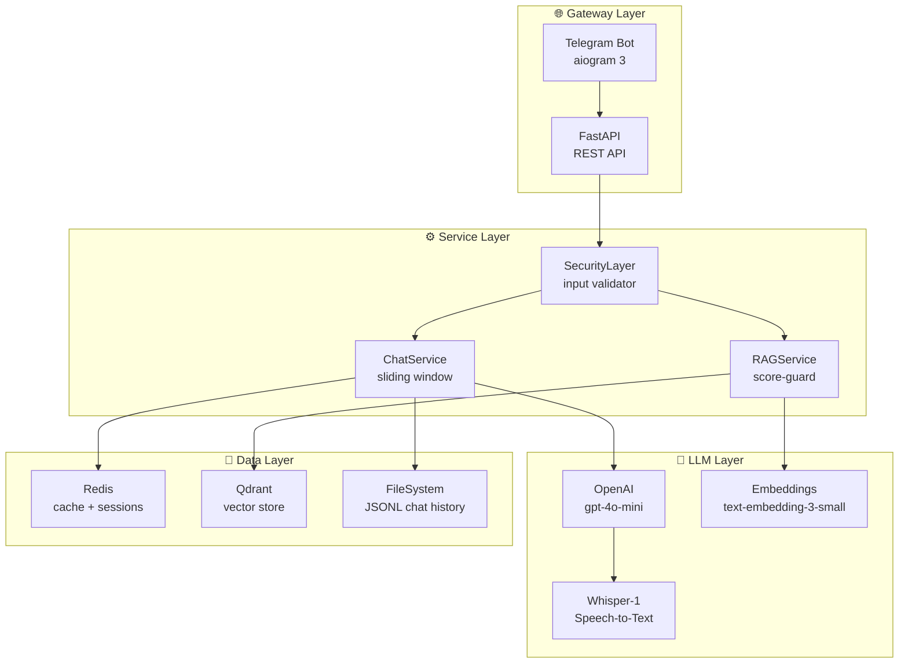

# Архитектурный паспорт — ИИ-консультант ТехноМаркет

## Диаграмма компонентов

```mermaid
graph TB
    subgraph Gateway["🌐 Gateway Layer"]
        TG[Telegram Bot<br/>aiogram 3]
        API[FastAPI<br/>REST API]
    end
    subgraph Service["⚙️ Service Layer"]
        CS[ChatService<br/>sliding window]
        RS[RAGService<br/>score-guard]
        SEC[SecurityLayer<br/>input validator]
    end
    subgraph LLM["🤖 LLM Layer"]
        OAI[OpenAI<br/>gpt-4o-mini]
        EMB[Embeddings<br/>text-embedding-3-small]
        WH[Whisper-1<br/>Speech-to-Text]
    end
    subgraph Data["💾 Data Layer"]
        RD[Redis<br/>cache + sessions]
        QD[Qdrant<br/>vector store]
        FS[FileSystem<br/>JSONL chat history]
    end
    TG --> API
    API --> SEC
    SEC --> CS
    SEC --> RS
    CS --> OAI
    RS --> EMB
    RS --> QD
    CS --> RD
    CS --> FS
    OAI --> WH
```

## ADR-001: Request-Response паттерн

**Контекст:** Нужно выбрать паттерн взаимодействия между клиентом и LLM-сервисом.

**Решение:** Request-Response с опциональным стримингом через SSE.

**Обоснование:**
- Простота реализации и отладки
- Совместимость со всеми клиентами (curl, браузер, Telegram)
- SSE для стриминга не требует WebSocket инфраструктуры
- Stateless — легко масштабировать горизонтально

**Последствия:** При нагрузке >1000 RPS потребуется очередь задач (Celery/Redis Queue).

## ADR-002: Стратегия fault tolerance

**Контекст:** OpenAI API может быть недоступен или возвращать ошибки.

**Решение:** Fallback-цепочка OpenAI → OpenRouter → статический ответ.

**Обоснование:**
- Retry с exponential backoff для временных ошибок (429, 5xx)
- Быстрый фейл для постоянных ошибок (401, 400)
- Fallback гарантирует ответ пользователю даже при полном отказе LLM

**Параметры:**
- Max retries: 5
- Backoff: 1→2→4→8→16 сек
- Timeout: 30 сек

## Таблица точек отказа

| Компонент | Тип отказа | Последствие | Митигация |
|-----------|-----------|-------------|-----------|
| OpenAI API | Rate limit (429) | Задержка ответа | Retry + backoff |
| OpenAI API | Недоступен | Нет ответа | Fallback на OpenRouter |
| Redis | Недоступен | Нет кеша | Degraded mode — работает без кеша |
| Qdrant | Недоступен | Нет RAG | Fallback на обычный LLM |
| Telegram API | Недоступен | Бот не отвечает | Повторная отправка через 60с |

## Endpoints

| Метод | URL | Описание |
|-------|-----|---------|
| POST | /chat | Синхронный запрос к LLM |
| POST | /chat/stream | Стриминг через SSE |
| GET | /health | Liveness probe |
| GET | /ready | Readiness probe (Redis check) |
| GET | /models | Список доступных моделей |
| POST | /chats | Создать чат |
| POST | /chats/{id}/messages | Отправить сообщение |
| GET | /chats/{id}/messages | История чата |
| DELETE | /chats/{id}/messages | Очистить историю |
| POST | /rag/query | RAG-запрос с цитированием |

## Стек

| Слой | Технология |
|------|-----------|
| API | FastAPI 0.141, Pydantic v2 |
| LLM | OpenAI gpt-4o-mini, text-embedding-3-small |
| Vector DB | Qdrant v1.14 |
| Cache | Redis 7.4 |
| Bot | aiogram 3, httpx |
| Observability | structlog, PII-маскирование |
| Security | NVIDIA garak v0.15.0 |
| Контейнеризация | Docker, docker-compose |
